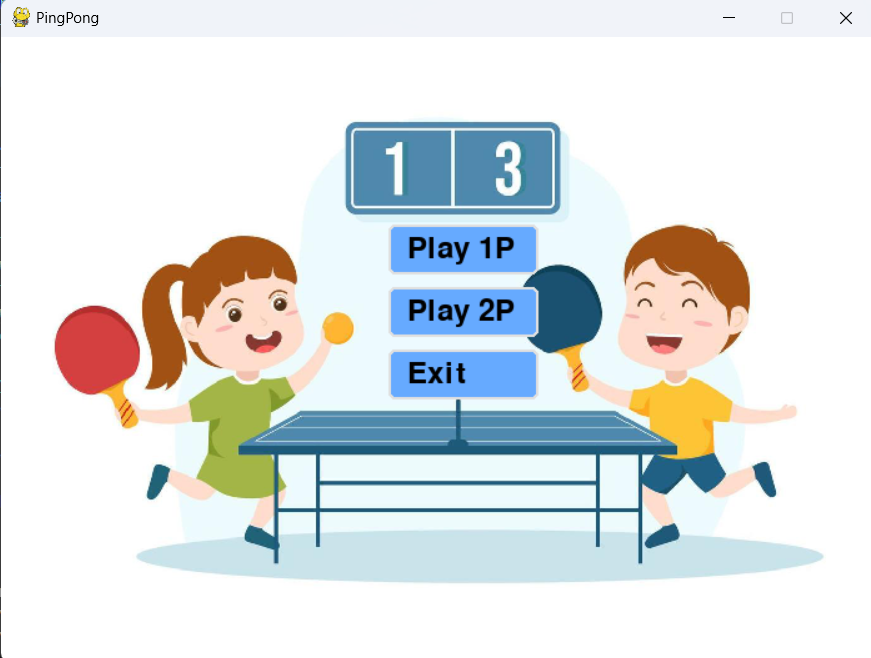
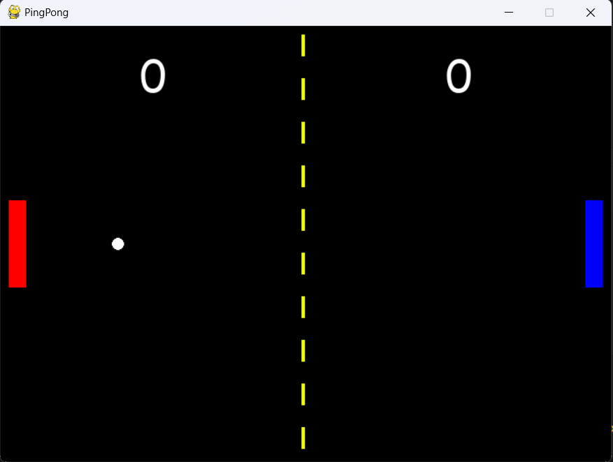
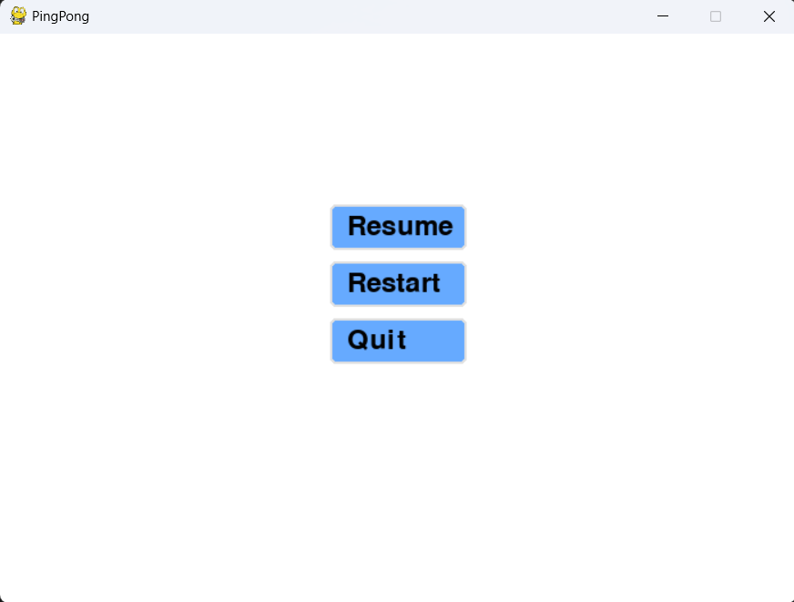

# Pingpongs

## Giới thiệu về phần 
Ping Pong là một trò chơi điện tử cổ điển và phổ biến, được lấy cảm hứng từ môn thể thao bóng bàn. Trò chơi này đã trở thành một biểu tượng của ngành công nghiệp game và đã thu hút hàng triệu người chơi trên toàn thế giới. Cùng bắt đầu trải nghiệm game nào 

## Giao diện chính của phần mềm
### Menu screen


### Play screen


### pause screen


### Win screen


## Cách cài đặt
Bước 1: Clone dự án về từ Git:
```bash
git clone https://github.com/HvnhanH/pygame-pingpongs.git

```
Bước 2: Di chuyển đến thư mục:
```bash
cd pingpongs

```
Bước 3: Cài đặt thư viện cần thiết cho ứng dụng
```bash
pip install pygame
```
Bước 4: Chạy chương trình
```bash
python pingpong.py
```

